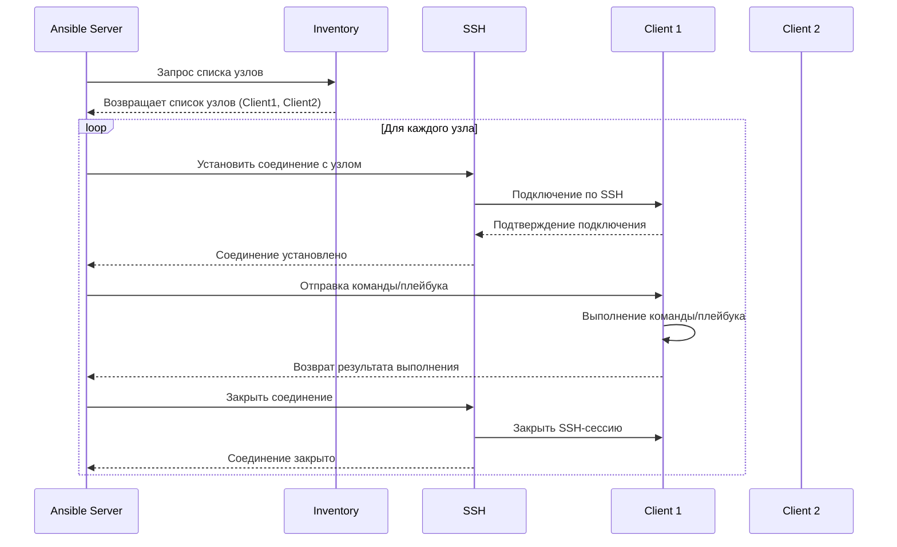

# ansible. inventory. part one.

всем привет, я начинающий **devOps** инженер - никита, и я решил создать этот репозиторий и эту небольшую статью для всех, кто начинает изучать и погружаться в этот крутой инструмент автоматизации. в статье возможны некоторые не точности, поэтому правки и корректировки только приветствуются. этот материал, как кусок моей памяти, отрывок того, что я понял, и что показалось мне полезным для других. документация по этому тулу читается не очень сложно, но есть аспекты, на которые я потратил достаточно времени, чтобы осознать их. 

# что такое ansible?
 Ansible  предоставляет  автоматизацию с открытым  исходным кодом, которая  снижает  сложность  и  выполняется  повсеместно.  Использование  Ansible  позволяет  автоматизировать  практически  любую  задачу. Вот  несколько  распространенных  вариантов  использования  Ansible: 
- устранения  повторений  и  упрощение рабочих процессов
- управление конфигурацией  системы  и  поддержка 
-  регулярное  развертывание  сложного  программного обеспечения
-  обновления  без  простоев

## inventory -  кто это такой?
одной из главных преимуществ ansible - это управление клиентами (серверами) без установки на них агента, то есть банальное подключение по SSH (если это Linux), либо по winrm (если это Windows) машинка.
файл инвентаризации (inventory) содержит в себе список управляемых узлов (nodes) - компьютеров, к которым нужно подключиться и выполнить определенные tasks.  такой файл позволяет подключаться одновременно к большому количеству машин с помощью одной терминальной команды.

    ansible  myhosts  -m  ping  -i  inventory.yml
   
   

> для подключения по SSH мы должны  убедиться, что  наш  открытый  SSH-ключ  добавлен  в  файл  **authorized_keys**  на  каждом  хосте. это важно!

## пример файла inventory
есть два популярных формата, в котором пишут такие файлы - yaml и ini. я предпочитаю yaml, поэтому буду показывать на нем. по ini формату, можете глянуть доку :)

вообще, по умолчанию, этот файл располагается тут: 

> /etc/ansible/hosts

как минимум, в файле инвенторизации есть 2 группы, Ansible их создает по умолчанию:

 - all
 - ungrouped

вы у меня умные, поэтому я не буду особо объяснять какая группа, что содержит)

basic inventory file in YAML format:

    ungrouped:
      hosts:
        mail.example.com:
    webservers:
      hosts:
        foo.example.com:
        bar.example.com:
    dbservers:
      hosts:
        one.example.com:
        two.example.com:
        three.example.com:

как вы думаете, можно ли в нескольких группах использовать один и тот же хост?

> я вам отвечу -  можно!

    ungrouped:
          hosts:
            mail.example.com:
        webservers:
          hosts:
            foo.example.com:
            bar.example.com:
            one.example.com:
        dbservers:
          hosts:
            one.example.com:
            two.example.com:
            three.example.com:

это просто для демонстрации, потому что в данном кейсе, это не лучший пример, ибо веб-сервер и база-данных  это две разные роли. 

## как нам правильно создать группу то?

тут разработчики нам не поленились рассказать, по каким критериям лучше всего это делать:

 1. что это ? приложение, веб-сервер, база данных - `database_server, webserver and etc`
 2. местоположение машинки: датацентр или регион - `east, west`
 3. авторитет машинки: `prod, test`

   
##  семья: родители и дети - parent/child
тут не сильно сложно, как в наследовании, только наоборот - 

> 1) любая машина входящая в дочернюю группу, автоматически становится
> членом родительской.
> 2) группы могут иметь несколько родительских и дочерних узлов, главное чтобы не циклические связи были. 

    east:
      hosts:
	      foo.example.com:
	      one.example.com:
	      two.example.com:
    west:
      hosts:
	      bar.example.com:
	      three.example.com:
    prod:
      children:
	      east:
    test:
      children:
	      west:

## переменные в inventory файле

такие переменные можно использовать в playbook-ах

    russia:
      hosts:
        host1:
          http_port: 80
          maxRequestsPerChild: 808
        host2:
          http_port: 303
          maxRequestsPerChild: 909

## алиасы инвентаря

    # ...
      hosts:
        hunter:
          ansible_port: 5555
          ansible_host: 192.0.2.50

В  этом  примере  запуск  ansible  с  псевдонимом  хоста  “hunter”  приведет к подключению  к  192.0.2.50  через  порт  5555.

## переменные для группы хостов

если все хосты в группе имеют общее значение переменной, вы можете применить эту переменную сразу ко всей группе:

    atlanta:
      hosts:
        host1:
        host2:
      vars:
        ntp_server: ntp.atlanta.example.com
        proxy: proxy.atlanta.example.com

### заключение
это первая вводная часть, вторая серия будет более углубленная, готовьтесь!
